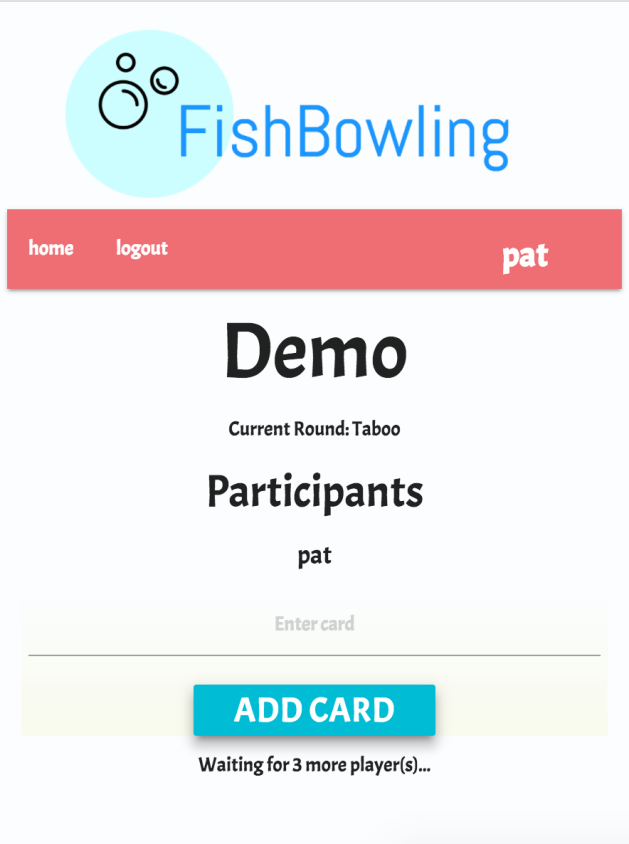
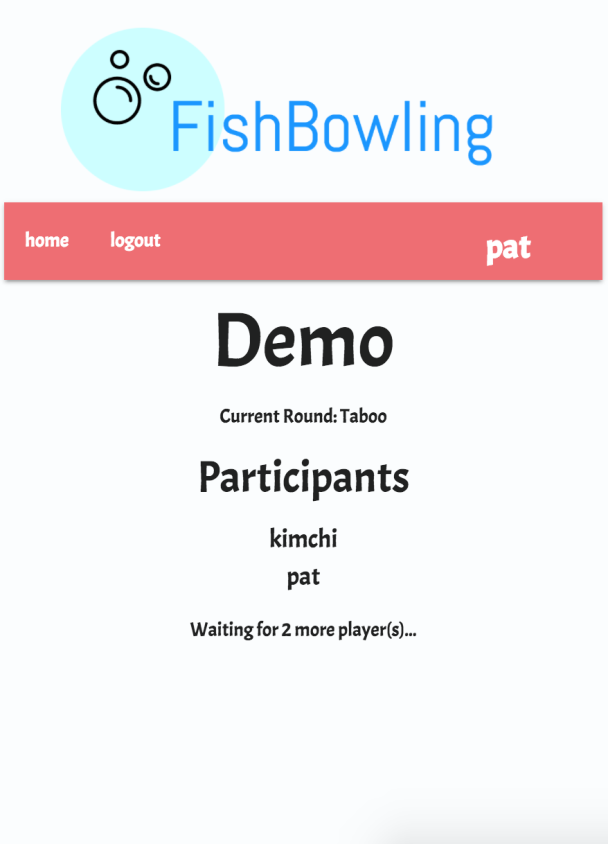
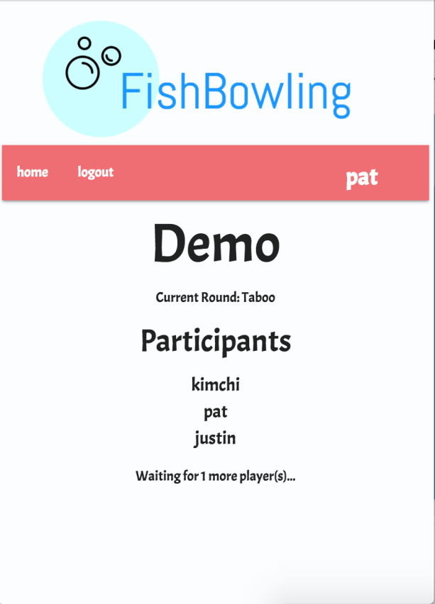
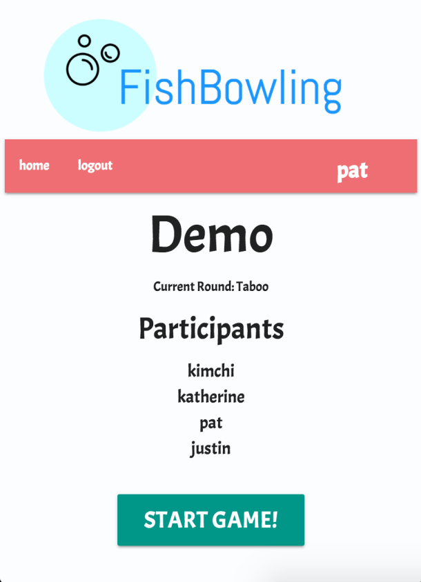
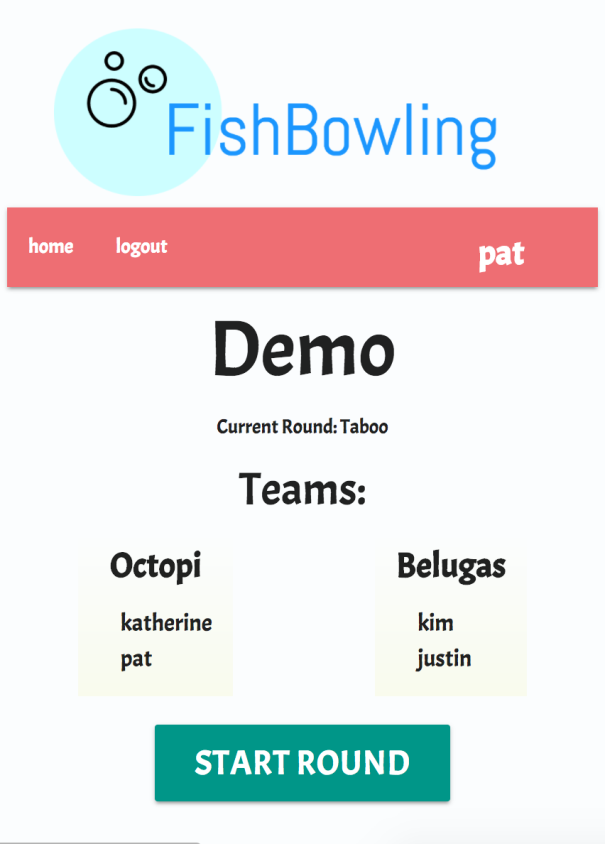
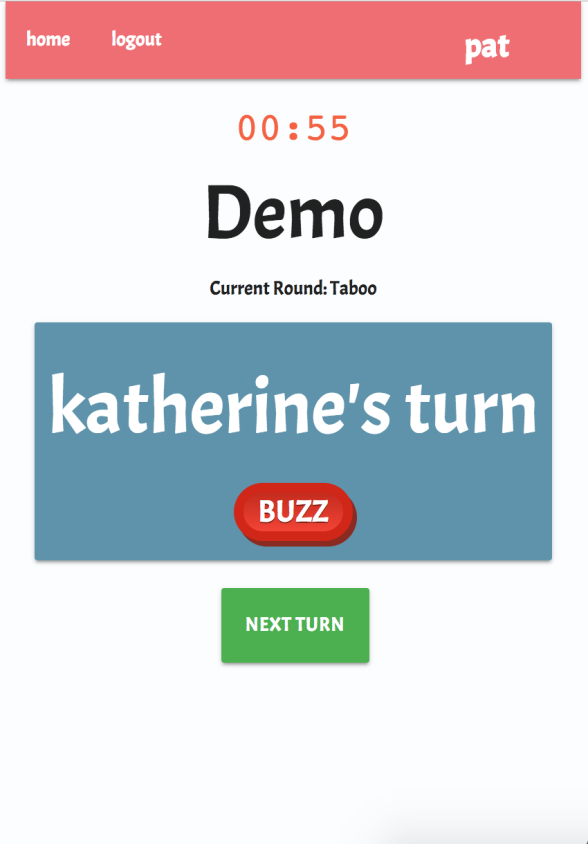
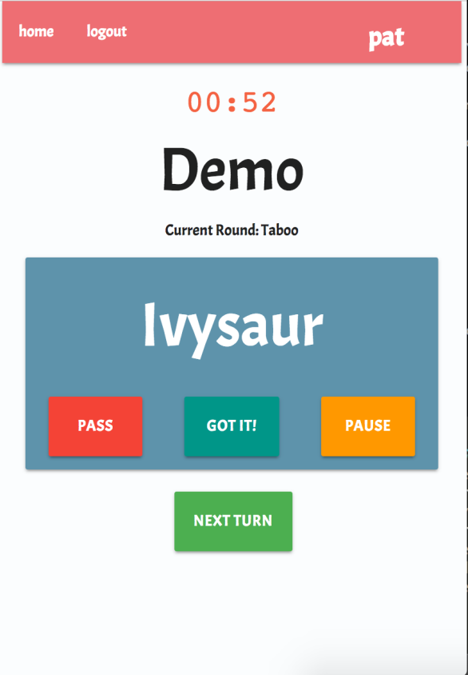
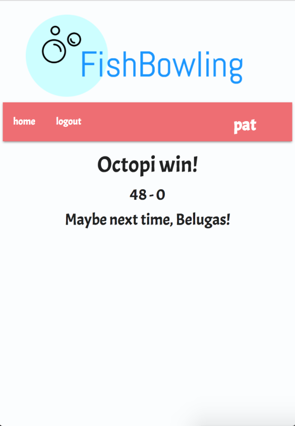

---

# FishBowling 

## Dev Bootcamp Final Project

FishBowling was a final project for the Dev Bootcamp Sea Otters 2017 Cohort (Seattle). Check out the [slides](https://docs.google.com/presentation/d/1EDnoIuQV0TvPIrjGNi7uulNNv0xrA-Tkl6NI1yF0x3k/edit?usp=sharing) from our project demo!

### Contributors

* [Kim T. Tran](https://github.com/kimtran27)
* [Pat Holland](https://github.com/pholls)
* [Justin Grassé](https://github.com/justGrasse)
* [Katherine Guenther](https://github.com/KatherineGuenther)

### Description

FishBowling is a digital adaption of the fun party game [Fish Bowl](http://www.wikihow.com/Play-Fish-Bowl). Throughout the game there are 3 rounds with 4 or more players, each following with their mobile device or desktop. This app features realtime updates to a constantly changing, time-crunchingly exciting thrill-game.  Enjoy!

### FishBowling In Action

When you create a game, you're automatically added as the creator. You need to add 4 cards, and wait for at least 4 players.

As more players join, your view updates automatically with their display name, and whether you are waiting for more players or more cards.

Almost ready -- each team needs at least 2 players, so you have to wait for at least 4 players.

Once everyone has joined, and added their 4 cards, you're ready to go! The creator is the admin of the game, so they see a "start game" button.

Once you hit "start", the game automatically creates two teams. It randomly assigns each player to a team, and assigns a name of a random sea creature. The creator sees a "start round" button.

Before the round begins, everyone sees the type of round and the rule. For example, the first round is Taboo -- the player tries to describe the concept using any words, except for the ones on the card.

When it's another player's turn, everyone sees who is currently providing the clues, as well as a buzzer. If the current clue giver says an illegal word, anyone can buzz them -- when anyone pushes the buzzer, everyone's device makes a hilarious and obnoxious buzzing sound.

It's your turn! You see the concept, as well as "Pass", "Got It", and "Pause" buttons. If you can't get the concept on the card, you can Pass it. The card goes back into the fish bowl and a new random one is provided. If you click Got It, the card is removed from the bowl, and a point is added to your team's score. If you click Pause, the timer stops and the concept is hidden.

The creator is the only one who sees the "Next Turn" button -- at any time, they can skip the current turn.

Game over! When all three rounds have been played, the results appear. The winning team is featured prominently, as well as the score. Once a game has finished, you can always return to the url to view the results.

Better luck next time, Belugas!

#### Play Online

* Visit the game page on [heroku](https://fishbowling.herokuapp.com)!

#### Install Locally

* clone this repo
* enter `bundle install` into terminal
* enter `bin/rails server` into terminal
* in a web browser, open localhost:3000
* follow on-screen instructions

#### See Game on React

* enter `bundle && yarn` into terminal
* enter `foreman start -f Procfile.dev` into terminal
* in a web browser, open localhost:5000
* open localhost:5000/gameplay to see the LAST game in the database running on REACT
