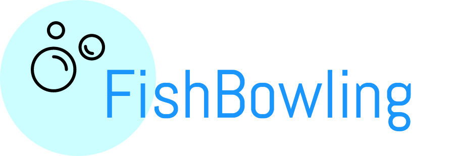

# FishBowling Presentation Outline

## Game Overview

* What is Fish Bowl?
* What is Fish Bowling?
    * Gameplay
   
## Workflow & Team Dynamics
* Planning (+ Jordan Picture)
* Trello
* Slack
* AGILE Workflow
* Git Workflow [+Contributing MD]

## Technologies Used

* Ruby
* Rails 5.0.1
    * ActionCable
* Heroku
* Redis
* JavaScript (ES6)
* RSpec
* Travis CI
* SimpleCov
* PostgreSQL
## Design Philosophies

* Mobile-first design
* Responsiveness
* Single Responsibility
* Less is more
   * Service Objects

## Features we're most proud of [+code samples]
* 

## Challenges [+code samples]

* ActionCable
* JavaScript Timer
* persisting time between Rounds
* passing game state data around
* Heroku deployment
    * game freezes at "next round" page
    * Ruby `sleep` method?
* hiding the timer when we need to
* building the pause pages between rounds and turns
* getting a buzzer to play on all devices

## Known Bugs

* Ruby `sleep` method glitch on heroku
* Scoring... meh
* Timer doesn't refresh immediately after wait-pages

## Live Demo [THE PAT SHOW]
* 

## The Future of FishBowling
* Player Stats
* Game Creator Options
   * Remove players
   * Update Scores
* TESTS

## Questions & Answers
* Team Photo!!!
